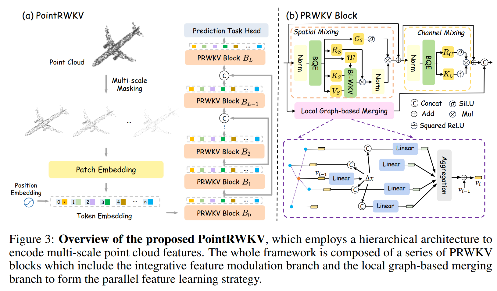
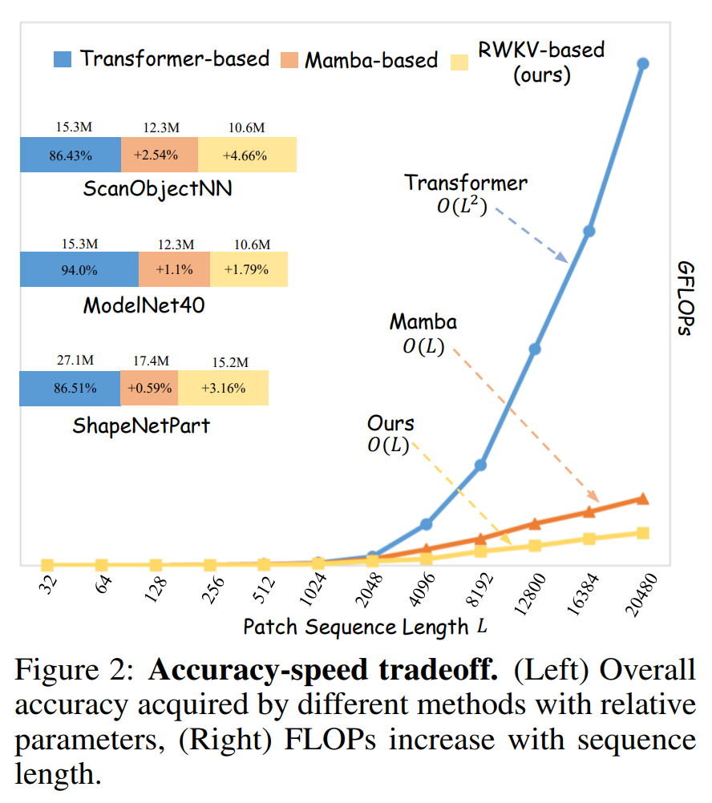
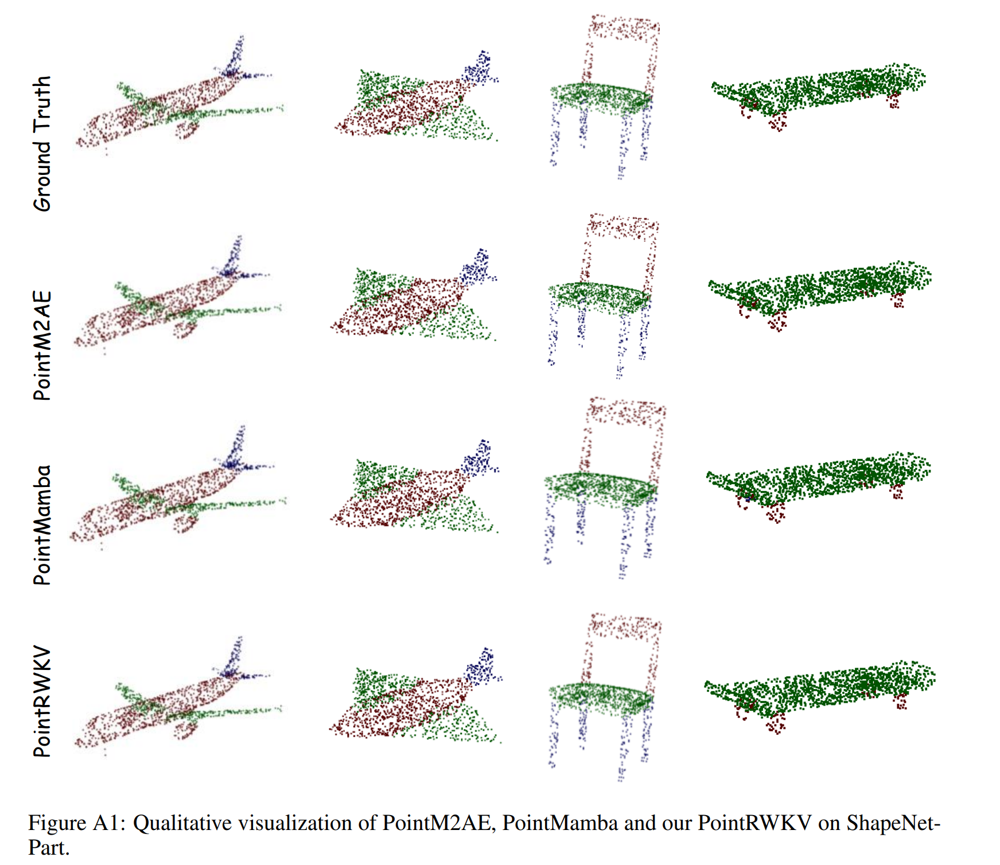

# [AAAI 2025] PointRWKV: Efficient RWKV-Like Model for Hierarchical Point Cloud Learning

<div style="display: flex; justify-content: center; align-items: center;">
  <a href="https://arxiv.org/abs/2405.15214" style="margin: 0 2px;">
    
  </a>
  <a href='https://hithqd.github.io/projects/PointRWKV/' style="margin: 0 2px;">
    
  </a>
</div>

## Abstract

Transformers have revolutionized point cloud learning, but their quadratic complexity hinders extension to long sequences. PointRWKV is a model of linear complexity derived from the RWKV architecture with necessary adaptations for 3D point cloud learning. It uses modified multi-headed matrix-valued states and a dynamic attention recurrence mechanism for global processing, alongside a parallel local graph branch with a graph stabilizer for local geometric feature extraction. The multi-scale hierarchical framework facilitates various downstream tasks while saving ~42% FLOPs compared to transformer-based counterparts.

## Architecture



**Key components:**
- **PRWKV Block**: Parallel dual-branch design
  - **IFM (Integrative Feature Modulation)**: Global processing via bidirectional WKV attention with linear complexity
  - **LGM (Local Graph-based Merging)**: Local geometric features via KNN graph with graph stabilizer
- **Bidirectional Quadratic Expansion (BQE)**: Broadens receptive field via shifted feature mixing
- **Dynamic Time-Varying Decay**: Adaptive decay for the WKV attention recurrence
- **Multi-scale Hierarchical Framework**: Asymmetric U-Net with 3 scales (2048/1024/512 points)

## Requirements

```bash
pip install -r requirements.txt

# Chamfer Distance & EMD (for pre-training)
cd extensions/chamfer_dist && python setup.py install --user && cd ../..
cd extensions/emd && python setup.py install --user && cd ../..

# PointNet++ ops
pip install "git+https://github.com/erikwijmans/Pointnet2_PyTorch.git#egg=pointnet2_ops&subdirectory=pointnet2_ops_lib"

# GPU kNN
pip install --upgrade https://github.com/unlimblue/KNN_CUDA/releases/download/0.2/KNN_CUDA-0.2-py3-none-any.whl
```

## Dataset Preparation

Organize your data directory as follows:

```
PointRWKV/
├── data/
│   ├── ModelNet/
│   │   └── modelnet40_normal_resampled/
│   │       ├── modelnet40_shape_names.txt
│   │       ├── modelnet40_train.txt
│   │       ├── modelnet40_test.txt
│   │       ├── modelnet40_train_8192pts_fps.dat
│   │       └── modelnet40_test_8192pts_fps.dat
│   ├── ModelNetFewshot/
│   │   ├── 5way10shot/
│   │   ├── 5way20shot/
│   │   ├── 10way10shot/
│   │   └── 10way20shot/
│   ├── ScanObjectNN/
│   │   ├── main_split/
│   │   │   ├── training_objectdataset_augmentedrot_scale75.h5
│   │   │   ├── test_objectdataset_augmentedrot_scale75.h5
│   │   │   ├── training_objectdataset.h5
│   │   │   └── test_objectdataset.h5
│   │   └── main_split_nobg/
│   ├── ShapeNet55-34/
│   │   ├── shapenet_pc/
│   │   │   └── *.npy
│   │   └── ShapeNet-55/
│   │       ├── train.txt
│   │       └── test.txt
│   └── shapenetcore_partanno_segmentation_benchmark_v0_normal/
│       ├── 02691156/
│       ├── ...
│       ├── train_test_split/
│       └── synsetoffset2category.txt
```

**Download links:**
- **ModelNet40**: [Point-BERT repo](https://github.com/lulutang0608/Point-BERT/blob/49e2c7407d351ce8fe65764bbddd5d9c0e0a4c52/DATASET.md) or [official site](https://modelnet.cs.princeton.edu/)
- **ScanObjectNN**: [Official website](https://hkust-vgd.github.io/scanobjectnn/)
- **ShapeNet55**: [Point-BERT repo](https://github.com/lulutang0608/Point-BERT/blob/49e2c7407d351ce8fe65764bbddd5d9c0e0a4c52/DATASET.md)
- **ShapeNetPart**: [Stanford](https://shapenet.cs.stanford.edu/media/shapenetcore_partanno_segmentation_benchmark_v0_normal.zip)

## Model Zoo

| Task | Dataset | Acc. (Scratch) | Acc. (Pretrain) | Download |
|:-----|:--------|:---------------|:----------------|:---------|
| Pre-training | ShapeNet | - | - | [model](https://drive.google.com/file/d/1QXB1msBljSOPJhx5sGYpueOdCrY0yaCO/view?usp=sharing) |
| Classification | ModelNet40 | 94.66% | 96.16% | [scratch](https://drive.google.com/file/d/1iMN-iAGjKWAUpAoIOqaS9e_CI_wk5nhE/view?usp=sharing) / [finetune](https://drive.google.com/file/d/11iBDSwdTIpHldUGWIsFp9orbCwNf69fB/view?usp=sharing) |
| Classification | ScanObjectNN | 92.88% | 93.05% | [scratch](https://drive.google.com/file/d/1DQx_5t9DNSIT11zLh1LZWJ5I3zgDXfmM/view?usp=sharing) / [finetune](https://github.com/LMD0311/PointMamba/releases/download/ckpts/scan_objbg_pretrain.pth) |
| Part Seg. | ShapeNetPart | - | 90.26% mIoU | [model](https://drive.google.com/file/d/1hQnB8uGzFGXUWXzM9ihjobIE-O9h9c2v/view?usp=sharing) |

<div align="center">
  
</div>

## Training

### 1. Pre-training on ShapeNet

```bash
# Single GPU
python main_pretrain.py --config cfgs/pretrain.yaml --exp_name pretrain

# Multi-GPU (4 GPUs)
bash scripts/dist_train.sh 4 main_pretrain.py --config cfgs/pretrain.yaml --exp_name pretrain
```

### 2. Classification on ModelNet40

```bash
# Train from scratch
python main_cls.py --config cfgs/cls_modelnet40.yaml --exp_name cls_mn40_scratch

# Fine-tune from pre-trained model
python main_cls.py --config cfgs/cls_modelnet40.yaml --exp_name cls_mn40_ft \
    --ckpt experiments/pretrain/ckpts/epoch_300.pth

# Multi-GPU
bash scripts/dist_train.sh 4 main_cls.py --config cfgs/cls_modelnet40.yaml --exp_name cls_mn40_ft \
    --ckpt experiments/pretrain/ckpts/epoch_300.pth
```

### 3. Classification on ScanObjectNN

```bash
# PB_T50_RS (hardest variant)
python main_cls.py --config cfgs/cls_scan_hardest.yaml --exp_name cls_scan_hard \
    --ckpt experiments/pretrain/ckpts/epoch_300.pth

# OBJ_BG variant
python main_cls.py --config cfgs/cls_scan_objbg.yaml --exp_name cls_scan_objbg \
    --ckpt experiments/pretrain/ckpts/epoch_300.pth
```

### 4. Part Segmentation on ShapeNetPart

```bash
python main_seg.py --config cfgs/seg_shapenetpart.yaml --exp_name seg_snp \
    --ckpt experiments/pretrain/ckpts/epoch_300.pth
```

## Testing / Inference

### Classification

```bash
# Standard test
python main_cls.py --config cfgs/cls_modelnet40.yaml --test \
    --ckpt experiments/cls_mn40_ft/ckpts/best.pth

# Test with voting (10 augmented views)
python main_cls.py --config cfgs/cls_modelnet40.yaml --test --vote \
    --ckpt experiments/cls_mn40_ft/ckpts/best.pth
```

### Part Segmentation

```bash
python main_seg.py --config cfgs/seg_shapenetpart.yaml --test \
    --ckpt experiments/seg_snp/ckpts/best.pth
```

## Project Structure

```
PointRWKV/
├── cfgs/                          # Configuration files
│   ├── pretrain.yaml              # Pre-training config
│   ├── cls_modelnet40.yaml        # ModelNet40 classification
│   ├── cls_scan_hardest.yaml      # ScanObjectNN (hardest) classification
│   ├── cls_scan_objbg.yaml        # ScanObjectNN (OBJ_BG) classification
│   ├── cls_fewshot.yaml           # Few-shot classification
│   └── seg_shapenetpart.yaml      # ShapeNetPart segmentation
├── models/                        # Model implementations
│   ├── point_rwkv.py              # Core PointRWKV backbone (BQE, WKV, LGM, PRWKVBlock)
│   ├── point_rwkv_cls.py          # Classification model
│   ├── point_rwkv_seg.py          # Part segmentation model
│   ├── point_rwkv_pretrain.py     # MAE pre-training model
│   ├── pointnet2_utils.py         # PointNet++ utilities (FPS, grouping, FP)
│   └── build.py                   # Model builder
├── datasets/                      # Dataset implementations
│   ├── ModelNetDataset.py         # ModelNet40
│   ├── ScanObjectNNDataset.py     # ScanObjectNN
│   ├── ShapeNet55Dataset.py       # ShapeNet55 (pre-training)
│   ├── ShapeNetPartDataset.py     # ShapeNetPart (segmentation)
│   ├── ModelNetDatasetFewShot.py  # Few-shot ModelNet
│   ├── data_transforms.py         # Data augmentation
│   └── io.py                      # File I/O helpers
├── utils/                         # Utility modules
│   ├── logger.py                  # Logging
│   ├── registry.py                # Class registry
│   ├── config.py                  # YAML config loader
│   ├── misc.py                    # FPS, KNN, point cloud utils
│   └── checkpoint.py              # Checkpoint save/load
├── scripts/                       # Shell scripts
│   ├── dist_train.sh              # Distributed training
│   └── dist_test.sh               # Distributed testing
├── main_pretrain.py               # Pre-training entry point
├── main_cls.py                    # Classification entry point
├── main_seg.py                    # Segmentation entry point
└── requirements.txt               # Python dependencies
```

## Key Hyperparameters

| Setting | Pre-train | Classification | Segmentation |
|:--------|:----------|:---------------|:-------------|
| Optimizer | AdamW | AdamW | AdamW |
| Learning Rate | 1e-3 | 3e-4 | 5e-4 |
| Weight Decay | 0.05 | 0.05 | 0.05 |
| Epochs | 300 | 300 | 300 |
| Warmup Epochs | 10 | 10 | 10 |
| Batch Size | 128 | 32 | 16 |
| Scheduler | Cosine | Cosine | Cosine |
| Embed Dim | 384 | 384 | 384 |
| Num Heads | 8 | 8 | 8 |
| Encoder Depth | [4, 4, 4] | [4, 4, 4] | [4, 4, 4] |
| Mask Ratio | 80% | - | - |
| Label Smoothing | - | 0.2 | - |

## Qualitative Results



## Acknowledgement

This project builds upon [Point-BERT](https://github.com/lulutang0608/Point-BERT), [Point-MAE](https://github.com/Pang-Yatian/Point-MAE), and [Point-M2AE](https://github.com/ZrrSkywalker/Point-M2AE). Thanks for their wonderful works.

## Citation

If you find this repository useful, please consider giving a star and a citation:

```bibtex
@article{he2024pointrwkv,
  title={PointRWKV: Efficient RWKV-Like Model for Hierarchical Point Cloud Learning},
  author={He, Qingdong and Zhang, Jiangning and Peng, Jinlong and He, Haoyang and Li, Xiangtai and Wang, Yabiao and Wang, Chengjie},
  journal={arXiv preprint arXiv:2405.15214},
  year={2024}
}
```
